# BuildStream Release 2 -- Sprint 1 Demo

**Date:** April 14, 2026  
**Sprint:** Sprint 1 (Weeks 1-2)  
**Sprint Goal:** Core Build and Deploy pipeline APIs developed in parallel  
**Demo Job ID:** `d539a459-023e-4572-b0b8-ef9513b7e26e`

---

## Executive Summary

Sprint 1 delivers the core API endpoints for both Build and Deploy pipelines. This document demonstrates **tasks S1-3 through S1-6** working end-to-end, showcasing the new **ImageGroup/Image data model**, enhanced **Parse-Catalog** and **Build-Image** APIs, the new **Images API**, and the renamed **Deploy API** (formerly `validate-image-on-test`).

### Tasks Covered

| Task | Title | Component | Status |
|------|-------|-----------|--------|
| **S1-3** | ImageGroup/Image ORM Data Models | C1 | Complete |
| **S1-4** | Parse-Catalog & Build-Image API Enhancements | C1 | Complete |
| **S1-5** | Images API (`GET /images`) | C2 | Complete |
| **S1-6** | Deploy API (`POST /stages/deploy`) | C2 | Complete |

---

## 1. Architecture Overview

### 1.1 End-to-End Pipeline Flow

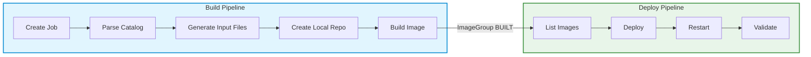

### 1.2 Data Model (S1-3)

The **ImageGroup/Image data model** is the foundational data structure introduced in Sprint 1. It establishes the 1:1 relationship between a Job and its built images, enabling the pipeline split between Build and Deploy.

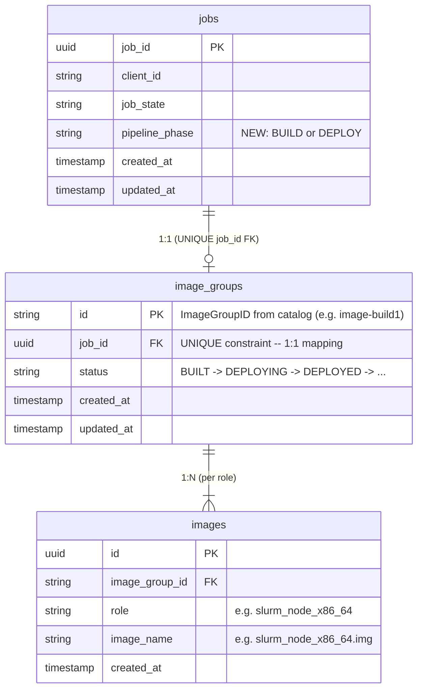

**Key Design Decisions:**
- `image_groups.id` is a human-readable string from the catalog (`Identifier` field), not a UUID
- `UNIQUE` constraint on `job_id` enforces strict 1:1 mapping between Job and ImageGroup
- `UNIQUE` constraint on `(image_group_id, role)` ensures one image per role per group
- `status` field drives the state machine for the entire deploy lifecycle

### 1.3 ImageGroup State Machine

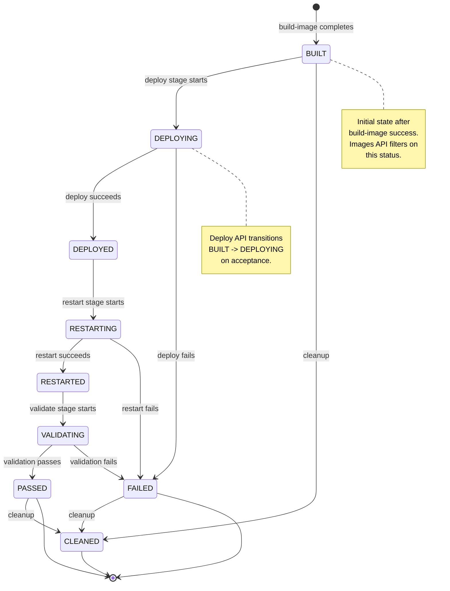

---

## 2. Demo Flow -- Task S1-4: Parse-Catalog API

### 2.1 Parse-Catalog Success (New ImageGroup)

Parse-Catalog extracts the `image_group_id` from the catalog JSON, checks for uniqueness against the `image_groups` table, and persists catalog metadata for downstream consumption.

**API Request:**

```
POST /api/v1/jobs/d539a459-023e-4572-b0b8-ef9513b7e26e/stages/parse-catalog
Content-Type: multipart/form-data
Authorization: Bearer <token>

file=@catalog_rhel_x86_64_with_slurm_only.json
```

**API Response (200 OK):**

```json
{
  "status": "success",
  "message": "Catalog parsed successfully"
}
```

**Job Status After Parse-Catalog:**

```json
{
  "job_id": "d539a459-023e-4572-b0b8-ef9513b7e26e",
  "job_state": "RUNNING",
  "stages": [
    {
      "stage_name": "parse-catalog",
      "stage_state": "COMPLETED",
      "started_at": "2026-04-14T05:24:16.701032+00:00Z",
      "ended_at": "2026-04-14T05:24:16.811642+00:00Z"
    }
  ]
}
```

> **S1-3 Evidence:** The parse-catalog stage extracts the `image_group_id` (`image-build1`) from the catalog `Identifier` field and validates uniqueness against the `image_groups` table. The ORM models `ImageGroupModel` and `ImageModel` are used throughout this flow.

### 2.2 Parse-Catalog Failure -- Duplicate ImageGroup (409 Conflict)

When the same catalog is submitted again (same `Identifier`), the API correctly rejects it with a 409 Conflict.

**API Request (new Job, same catalog):**

```
POST /api/v1/jobs/4c2c4051-05e9-40e2-b88a-1dfb419e65f6/stages/parse-catalog
Content-Type: multipart/form-data
Authorization: Bearer <token>

file=@catalog_rhel_x86_64_with_slurm_only.json
```

**API Response (409 Conflict):**

```json
{
  "detail": {
    "error_code": "DUPLICATE_IMAGE_GROUP",
    "message": "Image Group 'image-build1' already exists. Each catalog can only be built once.",
    "correlation_id": "test-correlation-id"
  }
}
```

> **S1-4 Evidence:** The uniqueness check per HLD Section 4.1.3.4 is correctly enforced. The `DuplicateImageGroupError` exception produces a clear 409 response with an actionable error message.

### 2.3 Parse-Catalog Flow Diagram

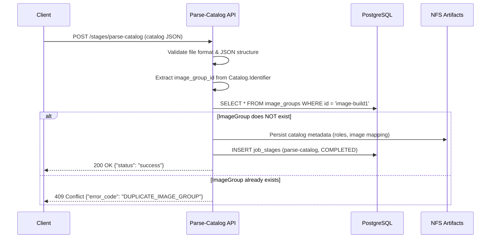

---

## 3. Demo Flow -- Task S1-4 (Part B): Build-Image API

### 3.1 Build-Image Invocation

Build-Image triggers the Ansible playbook to build OS images for each architecture. On success, it atomically creates the `image_groups` and `images` records.

**API Request:**

```
POST /api/v1/jobs/d539a459-023e-4572-b0b8-ef9513b7e26e/stages/build-image
Content-Type: application/json
Authorization: Bearer <token>

{
  "architecture": "x86_64",
  "image_key": "image-build1",
  "functional_groups": [
    "login_compiler_node_x86_64",
    "login_node_x86_64",
    "slurm_control_node_x86_64",
    "slurm_node_x86_64"
  ]
}
```

**API Response (202 Accepted):**

```json
{
  "job_id": "d539a459-023e-4572-b0b8-ef9513b7e26e",
  "stage": "build-image-x86_64",
  "status": "accepted",
  "submitted_at": "2026-04-14T05:33:32.330829Z",
  "correlation_id": "fdec5e77-b4f3-400f-831f-01f011a0d261",
  "architecture": "x86_64",
  "image_key": "image-build1",
  "functional_groups": [
    "login_compiler_node_x86_64",
    "login_node_x86_64",
    "slurm_control_node_x86_64",
    "slurm_node_x86_64"
  ]
}
```

### 3.2 Build-Image Status Polling

```
[   0s] build-image-x86_64: IN_PROGRESS
[  60s] build-image-x86_64: IN_PROGRESS
 ...
[2585s] build-image-x86_64: IN_PROGRESS
[2645s] build-image-x86_64: COMPLETED    <-- ~44 minutes
```

### 3.3 Database State After Build-Image (S1-3 + S1-4 Evidence)

On successful build, the API atomically creates the `image_groups` record and inserts `images` records for each role.

**`image_groups` Table:**

| id | job_id | status | created_at | updated_at |
|----|--------|--------|------------|------------|
| `image-build1` | `d539a459-023e-...` | **BUILT** | 2026-04-14 06:16:53 | 2026-04-14 06:16:53 |

**`images` Table (4 constituent images):**

| image_group_id | role | image_name |
|----------------|------|------------|
| `image-build1` | `login_compiler_node_x86_64` | `login_compiler_node_x86_64.img` |
| `image-build1` | `login_node_x86_64` | `login_node_x86_64.img` |
| `image-build1` | `slurm_control_node_x86_64` | `slurm_control_node_x86_64.img` |
| `image-build1` | `slurm_node_x86_64` | `slurm_node_x86_64.img` |

**`job_stages` Record:**

| stage_name | stage_state | attempt | log_file_path |
|------------|-------------|---------|---------------|
| `build-image-x86_64` | COMPLETED | 1 | `/nfs/omnia/log/build_stream/.../build_image_x86_64.yml_20260414_053333.log` |

> **S1-3 Evidence:** The `ImageGroupModel` (PK: `id` String(128), UNIQUE FK: `job_id`) and `ImageModel` (UNIQUE(`image_group_id`, `role`)) ORM models are correctly populated. The 1:1 Job-to-ImageGroup mapping is enforced by the UNIQUE constraint on `job_id`.

### 3.4 Build-Image Data Flow

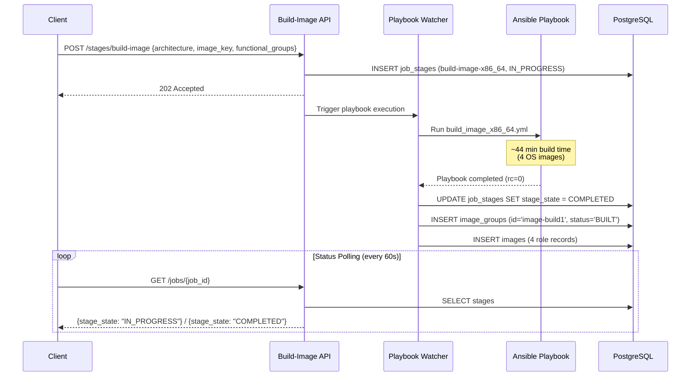

---

## 4. Demo Flow -- Task S1-5: Images API

### 4.1 List Built Images

The Images API enables the Deploy pipeline to discover available built image groups. It queries `image_groups` joined with `images`, filtered by status.

**API Request:**

```
GET /api/v1/images?status=BUILT&limit=100&offset=0
Authorization: Bearer <token>
```

**API Response (200 OK):**

```json
{
  "image_groups": [
    {
      "job_id": "d539a459-023e-4572-b0b8-ef9513b7e26e",
      "image_group_id": "image-build1",
      "images": [
        {
          "role": "login_compiler_node_x86_64",
          "image_name": "login_compiler_node_x86_64.img"
        },
        {
          "role": "login_node_x86_64",
          "image_name": "login_node_x86_64.img"
        },
        {
          "role": "slurm_control_node_x86_64",
          "image_name": "slurm_control_node_x86_64.img"
        },
        {
          "role": "slurm_node_x86_64",
          "image_name": "slurm_node_x86_64.img"
        }
      ],
      "status": "BUILT",
      "created_at": "2026-04-14T06:16:53.408086Z",
      "updated_at": "2026-04-14T06:16:53.408086Z"
    }
  ],
  "pagination": {
    "total_count": 1,
    "limit": 100,
    "offset": 0,
    "has_more": false
  }
}
```

> **S1-5 Evidence:** The `GET /images` endpoint correctly performs the `image_groups` + `images` JOIN, returns constituent images per role, supports pagination, and filters by status (default: `BUILT`). The response schema matches the HLD specification.

### 4.2 Images API Flow

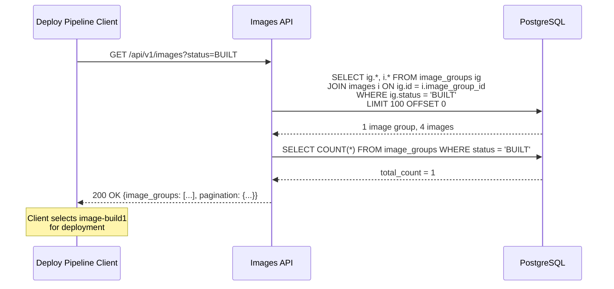

---

## 5. Demo Flow -- Task S1-6: Deploy API

### 5.1 API Rename: `validate-image-on-test` -> `deploy`

A key change in S1-6 is the **rename** of the `validate-image-on-test` endpoint to `deploy`. The legacy name referred to deploying and validating the image on a test node; the new name correctly reflects the separated pipeline stages.

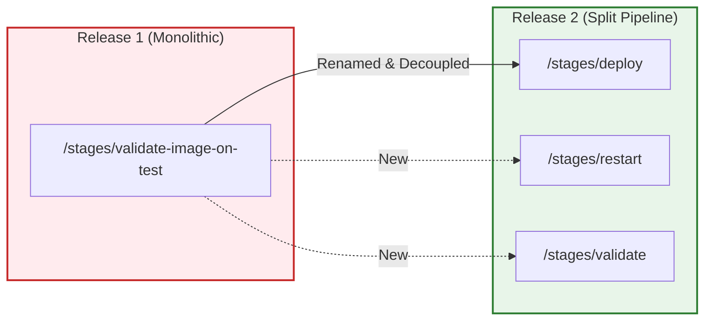

**Additional Changes in Deploy API:**
- Accepts `image_group_id` in request body (not present in R1)
- Validates 1:1 mapping via `image_groups.job_id` UNIQUE constraint
- Precondition check: `image_groups.status = BUILT` required
- Transitions `image_groups.status`: `BUILT` -> `DEPLOYING` -> `DEPLOYED`

### 5.2 Deploy API Invocation

**API Request:**

```
POST /api/v1/jobs/d539a459-023e-4572-b0b8-ef9513b7e26e/stages/deploy
Content-Type: application/json
Authorization: Bearer <token>

{
  "image_group_id": "image-build1"
}
```

**API Response (202 Accepted):**

```json
{
  "job_id": "d539a459-023e-4572-b0b8-ef9513b7e26e",
  "stage": "deploy",
  "status": "accepted",
  "submitted_at": "2026-04-14T07:03:46.227239Z",
  "image_group_id": "image-build1",
  "correlation_id": "a9f4581d-8804-4de5-96d8-726cc4218de5"
}
```

### 5.3 Deploy Status Polling

The deploy stage is asynchronous (202 Accepted). The client polls the Job status endpoint to track progress:

```
[  30s] deploy: IN_PROGRESS
[  60s] deploy: IN_PROGRESS
  ...
[ 420s] deploy: IN_PROGRESS
[ 450s] deploy: COMPLETED     <-- ~7.5 minutes
         log=/nfs/omnia/log/build_stream/.../provision.yml_20260414_064949.log
```

**Poll Response (during deploy):**

```json
{
  "job_state": "RUNNING",
  "stages": [
    {
      "stage_name": "deploy",
      "stage_state": "IN_PROGRESS",
      "started_at": "2026-04-14T07:03:46.227304+00:00Z",
      "ended_at": null,
      "error_code": null,
      "error_summary": null,
      "log_file_path": null
    }
  ]
}
```

**Poll Response (deploy completed):**

```json
{
  "stage_name": "deploy",
  "stage_state": "COMPLETED",
  "started_at": "2026-04-14T07:03:46.227304+00:00Z",
  "ended_at": "2026-04-14T07:11:11.688252+00:00Z",
  "error_code": null,
  "error_summary": null,
  "log_file_path": "/nfs/omnia/log/build_stream/d539a459-023e-4572-b0b8-ef9513b7e26e/provision.yml_20260414_064949.log"
}
```

### 5.4 Database State Transitions During Deploy

The Deploy API drives a sequence of state changes across multiple tables. The diagram below shows the three snapshots captured from the actual database:

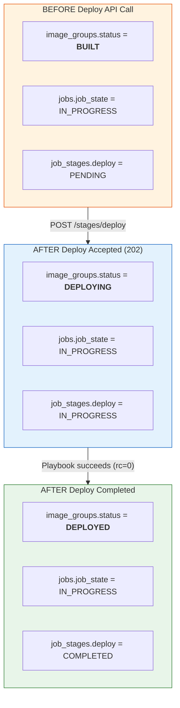

**Actual DB State -- Before Deploy:**

| Table | Column | Value |
|-------|--------|-------|
| `image_groups` | `status` | **BUILT** |
| `image_groups` | `updated_at` | `2026-04-14 06:16:53` |
| `jobs` | `job_state` | `IN_PROGRESS` |
| `job_stages` | `deploy.stage_state` | `PENDING` |

**Actual DB State -- During Deploy (DEPLOYING):**

| Table | Column | Value |
|-------|--------|-------|
| `image_groups` | `status` | **DEPLOYING** |
| `image_groups` | `updated_at` | `2026-04-14 07:03:46` |
| `job_stages` | `deploy.stage_state` | `IN_PROGRESS` |
| `job_stages` | `deploy.started_at` | `2026-04-14T07:03:46` |

**Actual DB State -- After Deploy Success (DEPLOYED):**

| Table | Column | Value |
|-------|--------|-------|
| `image_groups` | `status` | **DEPLOYED** |
| `image_groups` | `updated_at` | `2026-04-14 07:11:11` |
| `jobs` | `job_state` | `IN_PROGRESS` |
| `job_stages` | `deploy.stage_state` | `COMPLETED` |
| `job_stages` | `deploy.ended_at` | `2026-04-14T07:11:11` |
| `job_stages` | `deploy.log_file_path` | `/nfs/omnia/log/build_stream/.../provision.yml_20260414_064949.log` |

> **S1-6 Evidence:** The Deploy API correctly (1) validates `image_group_id` matches the Job's ImageGroup, (2) checks the BUILT precondition, (3) transitions `image_groups.status` to DEPLOYING on acceptance, (4) creates the `job_stages` record as IN_PROGRESS, (5) invokes the deploy wrapper playbook (provision.yml), (6) on playbook success transitions `image_groups.status` to DEPLOYED and marks the stage COMPLETED. The full `BUILT -> DEPLOYING -> DEPLOYED` state machine is exercised end-to-end.

### 5.5 Deploy API Flow

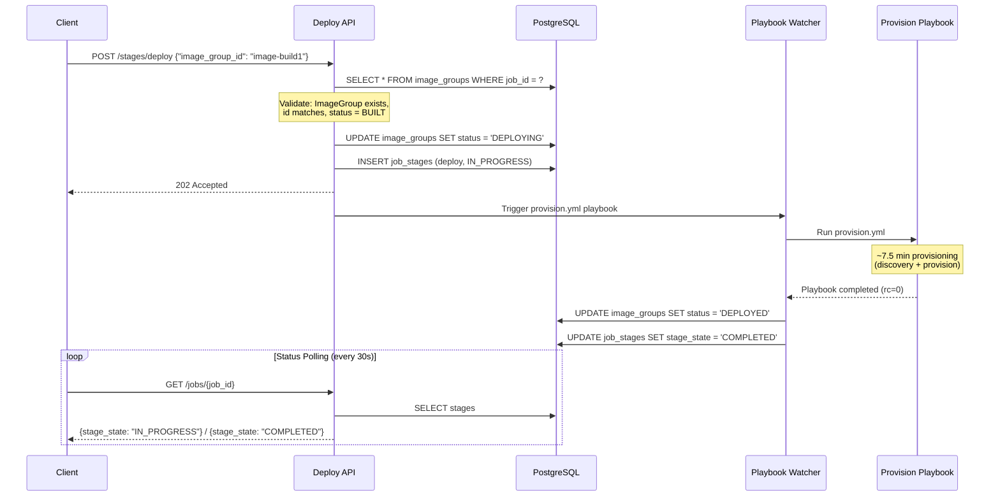

---

## 6. Complete Build Pipeline Execution Summary

### 6.1 Stage Execution Timeline

```mermaid
gantt
    title Build + Deploy Pipeline Stage Execution Timeline
    dateFormat HH:mm

    section Build Stages
    Parse Catalog        :done, pc, 05:24, 1m
    Generate Input Files :done, gif, 05:24, 1m
    Create Local Repo    :done, clr, 05:25, 3m
    Build Image x86_64   :done, bi, 05:33, 44m

    section Deploy Stage
    Deploy (provision)   :done, dep, 07:03, 8m
```

### 6.2 Job Stages Summary

| Stage | State | Duration | Notes |
|-------|-------|----------|-------|
| `parse-catalog` | COMPLETED | <1s | Catalog parsed, image_group_id extracted, uniqueness validated |
| `generate-input-files` | COMPLETED | <1s | Network/storage configs generated |
| `create-local-repository` | COMPLETED | ~2.5 min | YUM/DNF repo created via Ansible playbook |
| `build-image-x86_64` | COMPLETED | ~44 min | 4 OS images built; `image_groups` + `images` records created |
| `deploy` | **COMPLETED** | **~7.5 min** | **Provisioning playbook succeeded; `image_groups.status` -> DEPLOYED** |
| `build-image-aarch64` | SKIPPED | - | Not in catalog architecture |

### 6.3 Database Records Summary

**Before API Execution:**

| Table | Records |
|-------|---------|
| `image_groups` | 1 (pre-existing from prior run) |
| `images` | 4 (pre-existing from prior run) |

**After Full Pipeline Execution (Build + Deploy):**

| Table | Records | New |
|-------|---------|-----|
| `image_groups` | 2 | +1 (`image-build1`, status: **DEPLOYED**) |
| `images` | 8 | +4 (4 roles for `image-build1`) |
| `job_stages` | 9 | +9 (all stages for this job) |

**Final `image_groups` Record:**

| Column | Value |
|--------|-------|
| `id` | `image-build1` |
| `job_id` | `d539a459-023e-4572-b0b8-ef9513b7e26e` |
| `status` | **DEPLOYED** |
| `created_at` | `2026-04-14 06:16:53` (after build-image) |
| `updated_at` | `2026-04-14 07:11:11` (after deploy completed) |

---

## 7. ImageGroup Status Lifecycle -- Complete View

This diagram shows how the ImageGroup status progresses through the entire Build -> Deploy pipeline, including the specific API that drives each transition.

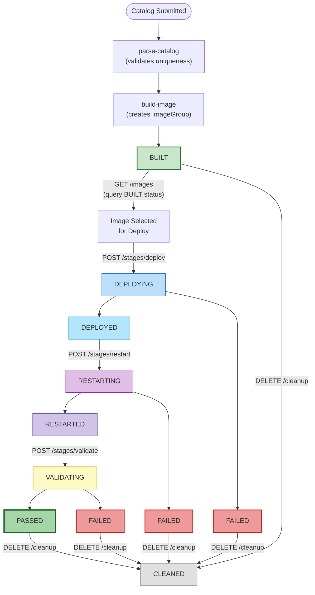

---

## 8. Pipeline Phase Tracking

The `pipeline_phase` column on the `jobs` table tracks which pipeline is currently operating on the Job. This enables clear separation of Build and Deploy concerns.

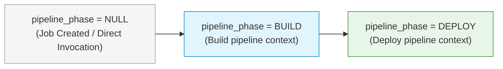

**Current Sprint 1 Behavior:**

| Phase | Column Value | Context |
|-------|-------------|---------|
| Job Created | `NULL` | Default -- direct API invocation (not triggered by GitLab pipeline) |
| Build stages | `NULL` | `pipeline_phase` is set to `BUILD` when invoked from the GitLab Build Pipeline |
| Deploy stage | `NULL` | `pipeline_phase` is set to `DEPLOY` when invoked from the GitLab Deploy Pipeline |

> **Note:** In Sprint 1, all API calls are made via direct invocation (curl / demo script), so `pipeline_phase` remains `NULL`. When the GitLab CI/CD pipelines are wired in Sprint 2, the pipeline will pass the appropriate phase context on job creation. The `ImageGroup.status` field (`BUILT -> DEPLOYING -> DEPLOYED`) is the primary state driver in Sprint 1, not `pipeline_phase`.

---

## 9. API Error Handling Matrix

| Scenario | Endpoint | HTTP Status | Error Code | Message |
|----------|----------|-------------|------------|---------|
| Duplicate ImageGroup | `parse-catalog` | **409** | `DUPLICATE_IMAGE_GROUP` | Image Group 'X' already exists |
| Job not found | Any stage | **404** | `JOB_NOT_FOUND` | Job not found |
| ImageGroup not found | `deploy` | **404** | `IMAGE_GROUP_NOT_FOUND` | No ImageGroup for this Job |
| ImageGroup ID mismatch | `deploy` | **409** | `IMAGE_GROUP_MISMATCH` | Supplied ID doesn't match Job's ImageGroup |
| Wrong status for deploy | `deploy` | **412** | `PRECONDITION_FAILED` | ImageGroup status is 'X', required: ['BUILT'] |
| Playbook failure | Any async stage | Async | `PLAYBOOK_EXECUTION_FAILED` | Recorded in `job_stages.error_code` via polling |
| Invalid status filter | `images` | **400** | `BAD_REQUEST` | Invalid status value |

---

## 10. Key Technical Highlights

### 10.1 Domain-Driven Design

```
core/image_group/
    entities.py           -- ImageGroup, Image domain entities
    value_objects.py      -- ImageGroupId, ImageGroupStatus, PipelinePhase
    state_machine.py      -- ALLOWED_TRANSITIONS, STATUS_FLOW, guard_check()
    repositories.py       -- Abstract repository interfaces
    exceptions.py         -- DuplicateImageGroupError, ImageGroupNotFoundError, etc.

infra/db/
    models.py             -- ImageGroupModel, ImageModel (SQLAlchemy ORM)
    repositories.py       -- SqlImageGroupRepository, SqlImageRepository
    mappers.py            -- ImageGroupMapper, ImageMapper (domain <-> ORM)

api/
    images/routes.py      -- GET /images endpoint
    deploy/routes.py      -- POST /stages/deploy endpoint
    parse_catalog/routes.py -- POST /stages/parse-catalog (enhanced)
    build_image/routes.py  -- POST /stages/build-image (enhanced)
```

### 10.2 Database Migration (Alembic 006)

The migration creates the new tables and modifies existing ones:

| Change | Table | Details |
|--------|-------|---------|
| **ADD COLUMN** | `jobs` | `pipeline_phase` (String(10), nullable) |
| **ADD COLUMN** | `job_stages` | `result_detail` (JSONB, nullable) |
| **CREATE TABLE** | `image_groups` | PK `id`, UNIQUE FK `job_id`, status with CHECK constraint |
| **CREATE TABLE** | `images` | PK `id`, FK `image_group_id`, UNIQUE(`image_group_id`, `role`) |

### 10.3 Constraint Enforcement

| Constraint | Table | Type | Purpose |
|-----------|-------|------|---------|
| `uq_image_groups_job_id` | `image_groups` | UNIQUE | 1:1 Job-to-ImageGroup mapping |
| `uq_images_image_group_id_role` | `images` | UNIQUE | One image per role per group |
| `ck_image_groups_status` | `image_groups` | CHECK | Valid status values only |
| `fk_image_groups_job_id` | `image_groups` | FOREIGN KEY | Cascading delete with Job |

---

## 11. What's Next -- Sprint 2

| Focus | Description |
|-------|-------------|
| **Pipeline Decomposition** | Split monolithic `.gitlab-ci.yml` into Build + Deploy child pipelines |
| **Playbook Integration** | Wire Deploy APIs to real Ansible playbooks end-to-end |
| **CleanUp API** | `DELETE /jobs/{id}/cleanup` -- NFS artifact cleanup |
| **End-to-End Flow** | Full Build-to-Validate flow triggered from GitLab commits |

---

*Generated from live API execution on 2026-04-14. All responses and database states are captured from the actual running system. Deploy completed successfully after provisioning playbook fix.*
